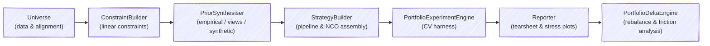

# flowportfolio


[](https://github.com/Vespertili0/flowportfolio/actions)
[](https://codecov.io/gh/Vespertili0/flowportfolio)
[](https://github.com/astral-sh/ruff)

A fluent portfolio experimentation API built on top of [skfolio](https://skfolio.org/).

`flowportfolio` abstracts away the boilerplate of `skfolio` (ticker validation, data alignment, constraint generation, hyperparameter tuning, tearsheet reporting, and physical portfolio rebalancing) into a concise, chainable API designed for rapid strategy research with real-world universes, such as ETFs.

---

## Features

| Component | Description |
|---|---|
| `Universe` | Downloads, validates, and aligns multi-asset return histories via `yfinance` |
| `ConstraintBuilder` | Fluent builder for group-level and turnover linear constraints |
| `PriorSynthesiser` | Denoised empirical priors, entropy-pooled market views, and VineCopula synthetic priors |
| `StrategyBuilder` | Assembles leak-proof `sklearn` pipelines and NCO ensembles |
| `PortfolioExperimentEngine` | Walk-forward, combinatorial, and randomised cross-validation harness |
| `Reporter` | Standardised three-panel tearsheet and stress-impact visualisation |
| `PortfolioDeltaEngine` | Quantifies trade-offs of rebalancing current holdings vs. target allocation, factoring in group drift and transaction friction |

---

## Installation

Using [uv](https://docs.astral.sh/uv/) (recommended):

```bash
uv add flowportfolio
```

Using pip:

```bash
pip install flowportfolio
```

---

## Quickstart

```python
from flowportfolio import (
    Universe,
    ConstraintBuilder,
    PortfolioExperimentEngine,
    Reporter,
)
from skfolio.optimization import MeanRisk
from skfolio.measures import RiskMeasure

# 1. Define and anchor the universe
universe = Universe(
    tickers=["SPY", "QQQ", "AGG", "GLD"],
    metadata={"SPY": "core", "QQQ": "satellite", "AGG": "defensive", "GLD": "defensive"},
    fees={"SPY": 0.0009, "QQQ": 0.0020, "AGG": 0.0003, "GLD": 0.0040},
)
universe.fetch_data(start="2022-01-01")
universe.anchor_history()

# 2. Build group constraints
constraints = (
    ConstraintBuilder(universe)
    .min_group("core", 0.40)
    .max_group("satellite", 0.30)
    .build()
)

# 3. Register strategies and run a walk-forward cross-validation
engine = PortfolioExperimentEngine(universe, constraints, n_jobs=-1)
engine.add_strategy(
    name="CoreSatellite",
    estimator=MeanRisk(risk_free_rate=0.03, linear_constraints=constraints),
    grid={"risk_measure": [RiskMeasure.VARIANCE, RiskMeasure.SEMI_VARIANCE]},
)
population = engine.run_robustness_test(cv_type="walk_forward", train_size=252, test_size=63)

# 4. Generate visual tearsheet
Reporter(population).generate_tearsheet(baseline_tag="CoreSatellite")
```

---

## Modular Capabilities

### 1. Market Views & Synthetic Stress-Testing

Inject forward-looking market views into Entropy Pooling priors or generate tail-preserving synthetic return paths via VineCopula models:

```python
from flowportfolio import PriorSynthesiser

synthesiser = PriorSynthesiser(universe)

# Entropy Pooling prior from market views
entropy_prior = (
    synthesiser
    .add_market_view("SPY > 0.05", confidence=0.8)
    .build_entropy_prior()
)

# Synthetic prior for stress-testing tail risk
synthetic_prior = synthesiser.build_synthetic_prior(n_samples=5000)
```

### 2. Strategy Assembly & Pipeline Construction

Build leak-proof `sklearn` pipelines with pre-selection filters, cross-sectional scalers, and fallback optimisers:

```python
from flowportfolio import StrategyBuilder
from skfolio.preprocessing import DropCorrelated, CSStandardScaler
from skfolio.optimization import MeanRisk, HierarchicalRiskParity

builder = StrategyBuilder(constraints=constraints)

pipeline = (
    builder
    .add_pre_selection(DropCorrelated(threshold=0.85))
    .add_cross_sectional(CSStandardScaler())
    .set_optimizer(
        optimizer=MeanRisk(linear_constraints=constraints),
        fallbacks=[HierarchicalRiskParity()],
    )
    .build_pipeline()
)
```

### 3. Rebalance & Friction Analysis

Evaluate physical portfolio allocations against target allocations to quantify group drift, risk/return deltas, and transaction friction:

```python
from flowportfolio import PortfolioDeltaEngine

current_holdings = {"SPY": 0.50, "QQQ": 0.20, "AGG": 0.20, "GLD": 0.10}
target_allocation = {"SPY": 0.40, "QQQ": 0.15, "AGG": 0.30, "GLD": 0.15}

delta_engine = PortfolioDeltaEngine(
    universe=universe,
    current_weights=current_holdings,
    target_weights=target_allocation,
)

# Group-level allocation drift
drift_df = delta_engine.calculate_group_drift()

# Risk/return comparison of holding vs rebalancing
delta_summary = delta_engine.calculate_rebalance_delta(population)

# Friction-adjusted net benefit analysis
friction = delta_engine.calculate_friction_adjusted_benefit(
    portfolio_value=100000.0,
    brokerage_flat=9.95,
    brokerage_bps=0.001,
    slippage_bps=0.0005,
)
```

---

## Architecture



---

## Development Setup

```bash
# 1. Clone the repository
git clone https://github.com/Vespertili0/flowportfolio.git
cd flowportfolio

# 2. Install dependencies (including dev extras)
uv sync

# 3. Install pre-commit hooks (ruff linting + formatting)
pre-commit install

# 4. Run pre-commit checks across all files
pre-commit run --all-files

# 5. Run the test suite
pytest
```

---

## Licence

This project is licenced under the MIT Licence.
